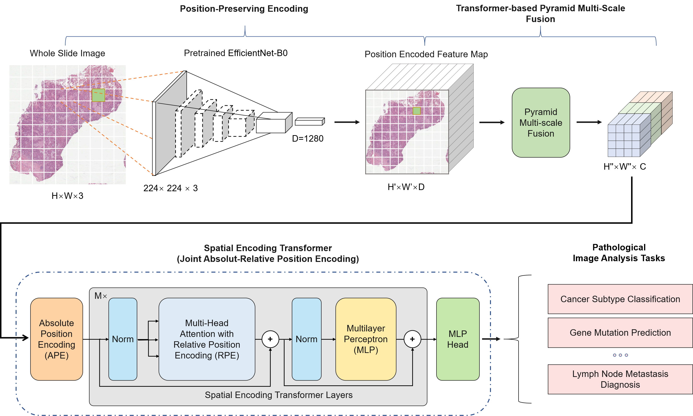
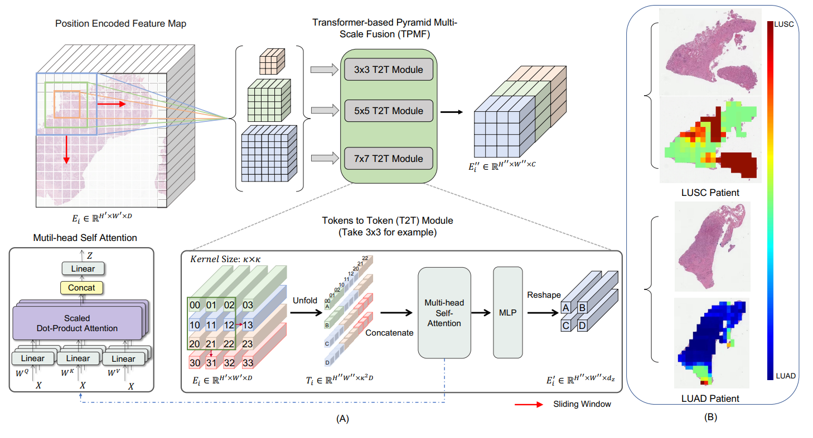

## Spatial Encoding Transformer-based Multiple Instance Learning for Pathological Image Analysis ##

Code for paper titled "SETMIL: Spatial Encoding Transformer-based Multiple Instance Learning for Pathological Image Analysis" submitted to CVPR2022. The basic method and applications are introduced as belows:

The overall framework of the proposed spatial encoding transformer-based MIL (SETMIL). 

 (A) illustrates the transformer-based pyramid multi-scale fusion module, which consists of three tokens-to-token
(T2T) modules working in a pyramid arrangement to modify the feature map and enrich a representation (token) with multi-scale
context information. Each tokens-to-token module has a soft-split and reshape process together with a transformer layer. Sub-figure
(B) shows a example heatmap for model interpretability. Colors reflect the prediction contribution of each local patch.

# Dependencies #
    rich
    yacs
    einops
    openslide-python
    opencv-python
    setuptools
    matplotlib
    Pillow
    scikit-image
    scikit-learn
    scipy
    cffi>=1.14.2
    numpy>=1.19.1
    pandas>=1.1.1
    pkgconfig==1.5.1
    pycparser==2.20
    python-dateutil==2.8.1
    pytz==2020.1
    pyvips==2.1.12
    six>=1.15.0
# Code for paper titled "SETMIL: Spatial Encoding Transformer-based Multiple Instance Learning for Pathological Image Analysis". #
Before you use this code, we need to configure the default.yaml. Here we provide a reference. 

1、First, in order to split the WSI into patches, execute the following script .

    python WSI_cropping.py 
      --dataset /folder/  
      --output /output_patch/
      --scale 20 --patch_size 1120 --num_threads 16

2、Then, extract features from each patch. a pre-trained feature extractor can be utilized here (e.g. EfficientNet-B0 trained on the ImageNet). 

    python extract_feature.py 
      -- WSI id1
        -- patch1 feat.pkl --> dict({'val': [1280] , 'tr': })
        -- patch2 feat.pkl
      -- WSI id2
        -- patch1 feat.pkl
        -- patch2 feat.pkl

3、Next, combine features of one WSI. 

    python merge_patch_feat.py --cfg configs/*.yaml

4、Finally, we can train the model with preprocessed data 

    python ./trans/main.py --cfg ./trans/configs/*.yaml
 
